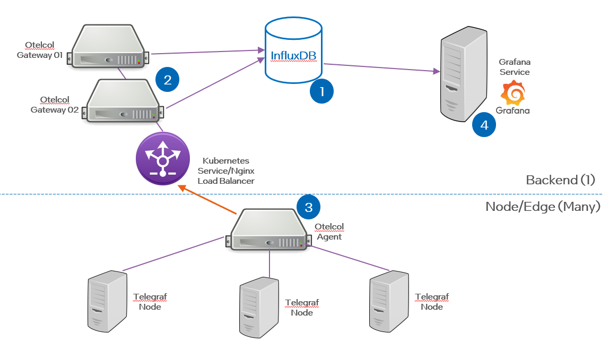

# Telemetry infrastructure 
The repo provided scalable Telemetry infrastructure references for both Docker (viadocker-compose) and Kubernetes (via Helm) approaches. User could select any of them or combined both approaches that suite the real scenario for deployment, each sub-component/service shall be able to communicate via exposed ip and port to each other regardless of deployment approach.

The recommended setup of this repo as below:
```
Node::Telegraf Node-> Node::OpenTelemetry Collector Agent-> Backend::OpenTelemetry Collector Gateway-> Backend::InfluxDB-> Backend::Grafana
```


## Deployment Order
Some sub-components/services have interdependencies, therefore, recommended to deploy them according to order below:
1. InfluxDB
   - Helm solution: [/helm/edge-iaas-platform/telemetry/influxdb2](/helm/edge-iaas-platform/platform-director/telemetry/influxdb2) 
   - Docker solution: [/docker/edge-iaas-platform/telemetry/influxdb](/docker/edge-iaas-platform/platform-director/telemetry/influxdb)
2. Open Telemetry Gateway (using gateway profile)
   - Helm solution: [/helm/edge-iaas-platform/telemetry/otelcol](/helm/edge-iaas-platform/platform-director/telemetry/otelcol)
   - Docker solution: [/docker/edge-iaas-platform/telemetry/docker/otelcol](/docker/edge-iaas-platform/platform-director/telemetry/otelcol)
3. Open Telemetry Agent (using agent profile)
   - Helm solution: [/helm/edge-iaas-platform/telemetry/otelcol](/helm/edge-iaas-platform/platform-manager/telemetry/otelcol)
   - Docker solution: [/docker/edge-iaas-platform/telemetry/docker/otelcol](/docker/edge-iaas-platform/platform-manager/telemetry/otelcol)
4. Grafana
   - Helm solution: [/helm/edge-iaas-platform/telemetry/grafana](/helm/edge-iaas-platform/platform-director/telemetry/grafana)
   - Docker solution: [/docker/edge-iaas-platform/telemetry/grafana](/docker/edge-iaas-platform/platform-director/telemetry/grafana)

Please read README in each respective directory for technical guidance.



## Default port number exposed in each services
Service | Helm (via Kubernetes Node Port) | Docker-Compose
--- | --- | ---
*InfluxDB* | **http://{any node ip}:32701** | **http://{host ip}:58100**
*Grafana* | **http://{any node ip}:32601** | **http://{host ip}:59500**
*OpenTelemetry Gateway* | **http://{any node ip}:31082** | **http://{host ip}:52199**
*OpenTelemetry Agent* | **http://{any node ip}:30695** | **http://{host ip}:52199**


## How to connect Telegraf node to Telemetry Infrastructure setup
This is assumed that user already installed "telegraf" ([installation](https://docs.influxdata.com/telegraf/v1.21/introduction/installation/)). 

### typical telegraf run
```
telegraf --config demo.conf
```
### enabling cpu and network metric for testing in Telegraf config file
```
....
[[inputs.cpu]]
    percpu = true
    totalcpu = true
    collect_cpu_time = false
    report_active = false
[[inputs.intel_powerstat]]
    cpu_metrics = ["cpu_frequency", "cpu_busy_frequency", "cpu_temperature", "cpu_c0_state_residency", "cpu_c1_state_residency", "cpu_c6_state_residency"]
...
```
### connecting to Open Telemetry Gateway/Agent according to user setup in Telegraf config file
*helm*
```
[[outputs.opentelemetry]]
  service_address  = "{ip address of OpenTelemetry Gateway or Agent}:31082 or 30695"
```
*docker-compose*
```
[[outputs.opentelemetry]]
  service_address  = "{ip address of OpenTelemetry Gateway or Agent}:52199"
```

### accessing Grafana Dashboard for data visualization
Open browser, paste following URL:

*helm*
```
http://{ip address of Grafana's host}:32601/
```
*docker-compose*
```
http://{ip address of Grafana's host}:59500/
```


Ensure browser's host is on reachable network to Telemetry Infrastructure host IP.   
